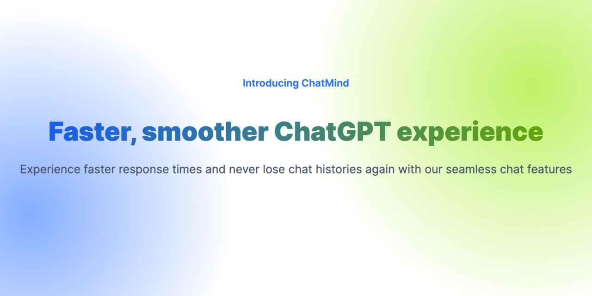

# ChatMind

Yet another fast and reliable ChatGPT app.

## ✨ Key features

- ⚡️ Faster chat responses
- 🔒 Reliable and secure, all your chat history is stored locally
- 📱 Responsive design, works on mobile and desktop
- 📀 Install PWA app with one click, no more install a 100Mb web app
- ⌨️ Keyboard as first class citizen, chat even faster with keyboard shortcuts
- 💧 Streaming supported, no more waiting for the whole response to load

## 🍡 Tech stack

- 
- 
- 
- 

## 🚀 Hosting platforms

